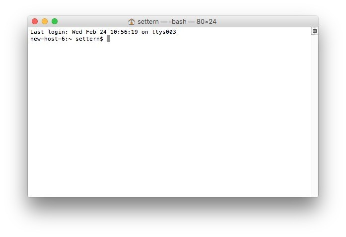

# Course Guide

These instructions are intended to get you from having nothing installed, to running a simple exploration of some fanfic projects. Wherever possible I've adjusted these instructions to work on Mac OS X.

## Instructions for use

This guide is split into two portions: **Instructions** and **Context**.

**Instructions** can be found in this Github folder, linked above. They're numbered in the order you'll be following them in. These contain the barebones instructions for getting everything running.

**Context** is the document you're reading right now - it's not going to step you through technical instructions - instead, it'll provide context for **why** we're doing things and try and explain steps that might be confusing.

You'll start on this **Context** page, learn why we're following these steps, then jump into the appropriate **Instructions** page, and then once you're done, jump back to **Context** so you can hopefully understand how what you just did fits into the bigger picture.

Occasionally, I'll offer **Summaries**. These are just little boxes filled with examples of code you can use to , and serve as a reference if you want to use those tools outside this guide.

Let's get started.

# 1 - Setup

In this step we're going to be installing some basic tools of the trade, and explaining why we're using them.

You can either jump to the instructions linked above at **1 - Setup** now and work through those, and read this bit after you're done; or read this bit now for context and then execute the instructions.

## The Terminal or Command Line

We'll be doing a lot of installation and running things from the command line, which in Mac can be controlled with Terminal. Technically, everything we're doing here could be done with graphical interfaces - but doing things with the command line cuts down on the amount of mistakes you might make, and it means what you're learning can be carried across to other machines with ease.

 

*A picture of what the command line interface looks like in Mac OS X. The prompt `new-host-6:~ settern%` tells us what environment we're in (new-host-6, our base system environment), where we are (~ means we're sitting in our home), and who we're currently logged in as (settern).*

The command line is powerful - we can install programs, run scripts, make and destroy directories, and a bunch of other things with it. For now though, all you need to know is when you see something like this.

`cd dir`

or this

`mkdir new_folder`

it represents something you can copy and paste into your command line and run.

## Python

**Python** is the language a lot of exploratory linguistics/data science researchers use. That's because it's a lot simpler than other languages, and it's easy to install libraries for it with **pip**.

**Libraries** are collections of code for performing certain tasks - these libraries can be huge and general and contain many modules, or they can contain just a few modules for doing very specific things, like the default libraries for basic math that come installed with Python.

For example, we're eventually going to install and use a Python library called **pandas** to explore our data.  

## Pip (the Python package installer)

A big advantage of Python is you can use something called **pip** to quickly install and setup Python packages. A lot of libraries come bundled up in pip packages, which contain everything pip needs to automatically setup the library.

 Once pip is installed, you can type `pip install [package]` to install most packages. And that's it! You're done. You can now use that package in your code however you'd like.

As a rule of thumb, if there's a Python package out there, you can probably install it with pip!

There's a problem though - if two packages are very different, they might conflict with each other. And it's normally really hard to resolve package conflicts once you've installed them wrong - sometimes it's faster just to nuke your machine and install a clean OS than it is to resolve bad conflicts.

This is where virtual environments come in.

## Virtual Environments

**Virtual environments** are a way to create an isolated environment for your python packages to work in.

Think of virtual environments as boxes you can install packages into and run your code from. You've installed the basic python package onto your OS, which is one big box.

You don't want to install two projects that might conflict with each other directly onto your system: this is a little bit like putting cats and dogs into the same box - bad stuff is going to happen if they're not separated.

But with virtual environments, you can create smaller boxes that sit inside your big system box, that contain all the packages you need to run your project. If you install all your cats in their own isolated box, and install all your dogs in another, you don't have to worry about them fighting with each other.

Basically: try not to do `pip install [package]` when you're not in a virtual environment unless you know what you're doing!

#### Summary - Some Useful Virtual Environment Commands

> #### Creating a virtual environment from the command line
> `virtualenv -m yourenv`
> Activating a virtual environment (while you're inside that folder)
> `source bin/activate`
> #### Exiting a virtual environment
> `deactivate` or `source deactivate`

# 2 - Installing our tools with Pip

In this section, we'll be installing the tools we need with the Pip package manager. This bit's pretty simple since we won't be using them right away, but it's worth giving them all a quick introduction.

- **Pandas** is a really nice Python toolset for data analysis - think Microsoft Excel on steroids. There's a lot of helpful tutorials out there for it, lots of cool extensions have been built around it, and it's got good documentation.

- **

- **FanFicFare** is a tool somebody's built to harvest fanfiction from the internet.

**
- ****

# 4 - Exploring data with Pandas and Jupyter Notebook

# 3 - Downloading data from WuxiaWorld

`fanficfare -l https://www.wuxiaworld.co/all/`

# 4 - Exploring WuxiaWorld with Pandas

# 5 - Exploring Wordnets

https://gist.github.com/aparrish/2f562e3737544cf29aaf1af30362f469
